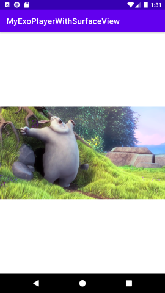
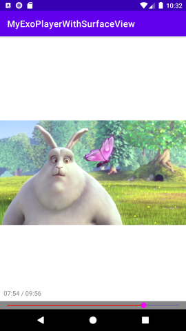
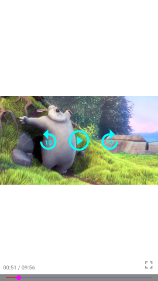
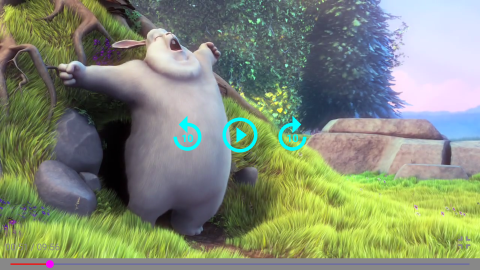

# MyExoPlayerWithSurfaceView
Android動画再生アプリを作る ( ExoPlayer2 + SurfaceView )  
https://www.hiramine.com/programming/videoplayer_exoplayer_surfaceview/index.html

## Screenshots : スクリーンショット
<kbd></kbd> <kbd></kbd> <kbd></kbd>  
<kbd></kbd>

## Requirements : 必要条件、依存関係
- Android Studio 4.2.2
- compileSdkVersion 30
- minSdkVersion 23
- minSdkVersion 30
- ExoPlayer 2.15.0

## Author : 作者
Nobuki HIRAMINE : [http://www.hiramine.com](http://www.hiramine.com)

## License : ライセンス
```
再生動画として、commondatastorage.googleapis.com の gtv-videos-bucket の sample に置いてある
「Big Buck Bunny」動画ファイルを使用しました。
https://commondatastorage.googleapis.com/gtv-videos-bucket/sample/BigBuckBunny.mp4
Big Buck Bunny
Copyright (C) 2008 Blender Foundation | peach.blender.org Some Rights Reserved.
Creative Commons Attribution 3.0 license. https://peach.blender.org/
```

```
Copyright 2021 Nobuki HIRAMINE

Licensed under the Apache License, Version 2.0 (the "License");
you may not use this file except in compliance with the License.
You may obtain a copy of the License at

    http://www.apache.org/licenses/LICENSE-2.0

Unless required by applicable law or agreed to in writing, software
distributed under the License is distributed on an "AS IS" BASIS,
WITHOUT WARRANTIES OR CONDITIONS OF ANY KIND, either express or implied.
See the License for the specific language governing permissions and
limitations under the License.
```
